# Autumn Book ERD

```mermaid
erDiagram

    FACILITIES {
        bigint id PK
        string code
        string name
        string timezone
        datetime created_at
        datetime updated_at
    }

    ROOM_TYPES {
        bigint id PK
        bigint facility_id FK
        string code
        string name
        int capacity_min
        int capacity_max
        int pms_sales_limit
        boolean is_active
        datetime created_at
        datetime updated_at
    }

    RATE_PLANS {
        bigint id PK
        bigint room_type_id FK
        string code
        string name
        boolean is_public
        int min_member_rank_order
        boolean is_active
        datetime created_at
        datetime updated_at
    }

    MEMBERS {
        bigint id PK
        string member_code
        string email
        string last_name
        string first_name
        int current_rank_order
        boolean is_mail_opt_in
        datetime joined_at
        datetime updated_at
    }

    MEMBER_RANKS {
        bigint id PK
        string code
        string name
        int rank_order
        boolean is_active
    }

    MEMBER_RANK_HISTORIES {
        bigint id PK
        bigint member_id FK
        bigint member_rank_id FK
        string reason
        datetime changed_at
    }

    EXTERNAL_INVENTORIES {
        bigint id PK
        bigint facility_id FK
        bigint room_type_id FK
        date stock_date
        int stock
        string source_system
        datetime synced_at
        datetime created_at
        datetime updated_at
    }

    RATE_CALENDARS {
        bigint id PK
        bigint rate_plan_id FK
        date stay_date
        int guest_count
        int room_price
        string currency
        datetime created_at
        datetime updated_at
    }

    OPTIONS {
        bigint id PK
        bigint facility_id FK
        string code
        string name
        string selectable_type
        string price_type
        int unit_price
        int min_value
        int max_value
        boolean is_active
        datetime created_at
        datetime updated_at
    }

    PLAN_OPTIONS {
        bigint id PK
        bigint rate_plan_id FK
        bigint option_id FK
        boolean is_required
        int sort_order
        datetime created_at
        datetime updated_at
    }

    OPTION_RECOMMEND_RULES {
        bigint id PK
        bigint option_id FK
        string condition_type
        string condition_value
        int priority
        boolean is_active
        datetime created_at
        datetime updated_at
    }

    SECRET_OFFERS {
        bigint id PK
        bigint facility_id FK
        bigint rate_plan_id FK
        string token
        int member_rank_min_order
        datetime starts_at
        datetime expires_at
        boolean is_active
        datetime created_at
        datetime updated_at
    }

    RESERVATIONS {
        bigint id PK
        string reservation_code
        bigint facility_id FK
        bigint room_type_id FK
        bigint rate_plan_id FK
        bigint member_id FK
        string status
        date checkin_date
        date checkout_date
        int guest_adult_count
        int guest_child_count
        int total_amount
        int cancel_fee_amount
        datetime canceled_at
        datetime checked_out_at
        int sales_amount
        int prepaid_amount
        int local_payment_amount
        string language
        datetime expires_at
        datetime created_at
        datetime updated_at
    }

    RESERVATION_OPTIONS {
        bigint id PK
        bigint reservation_id FK
        bigint option_id FK
        int selected_value
        int unit_price
        int total_price
        datetime created_at
        datetime updated_at
    }

    RESERVATION_EMAILS {
        bigint id PK
        bigint reservation_id FK
        string event_type
        string to_email
        string status
        string error_message
        datetime sent_at
        datetime created_at
        datetime updated_at
    }

    PAYMENTS {
        bigint id PK
        bigint reservation_id FK
        bigint facility_id FK
        string payment_type
        int amount
        string currency
        string payment_provider
        string provider_payment_id
        datetime paid_at
        int refunded_amount
        string payment_status
        datetime created_at
        datetime updated_at
    }

    PAYMENT_ATTEMPTS {
        bigint id PK
        bigint reservation_id FK
        string payment_intent_id
        int attempt_no
        string failure_code
        string failure_message
        boolean retryable
        datetime attempted_at
        datetime created_at
    }

    CANCELLATION_POLICIES {
        bigint id PK
        string code
        string name
        int version
        boolean is_active
        datetime created_at
        datetime updated_at
    }

    CANCELLATION_RULES {
        bigint id PK
        bigint cancellation_policy_id FK
        int days_before_checkin
        float fee_rate
        datetime created_at
        datetime updated_at
    }

    RATE_PLAN_CANCELLATION_POLICIES {
        bigint id PK
        bigint rate_plan_id FK
        bigint cancellation_policy_id FK
        datetime created_at
    }

    MAIL_CAMPAIGNS {
        bigint id PK
        string campaign_code
        string title
        int target_rank_order
        bigint linked_rate_plan_id FK
        datetime sent_at
        datetime created_at
        datetime updated_at
    }

    TL_CONNECTIONS {
        bigint id PK
        bigint facility_id FK
        string channel_type
        boolean is_enabled
        string environment
        datetime last_pushed_at
        string last_status
        string last_error_message
        string stopped_reason
        datetime updated_at
    }

    INVENTORY_SYNC_LOGS {
        bigint id PK
        bigint facility_id FK
        bigint room_type_id FK
        bigint rate_plan_id FK
        date stock_date
        int pms_stock
        int external_stock
        int pms_price
        int external_price
        boolean pms_closed
        boolean external_closed
        string severity
        datetime detected_at
        datetime resolved_at
    }

    FACILITIES ||--o{ ROOM_TYPES : has
    FACILITIES ||--o{ OPTIONS : has
    FACILITIES ||--o{ EXTERNAL_INVENTORIES : has
    FACILITIES ||--o{ RESERVATIONS : has
    FACILITIES ||--o{ PAYMENTS : has
    FACILITIES ||--o| TL_CONNECTIONS : configures
    FACILITIES ||--o{ SECRET_OFFERS : has
    FACILITIES ||--o{ INVENTORY_SYNC_LOGS : has

    ROOM_TYPES ||--o{ RATE_PLANS : has
    ROOM_TYPES ||--o{ EXTERNAL_INVENTORIES : has
    ROOM_TYPES ||--o{ RESERVATIONS : booked_as
    ROOM_TYPES ||--o{ INVENTORY_SYNC_LOGS : monitored

    RATE_PLANS ||--o{ RATE_CALENDARS : priced
    RATE_PLANS ||--o{ PLAN_OPTIONS : enables
    RATE_PLANS ||--o{ RESERVATIONS : reserved_under
    RATE_PLANS ||--o{ SECRET_OFFERS : offered_as
    RATE_PLANS ||--o| RATE_PLAN_CANCELLATION_POLICIES : uses
    RATE_PLANS ||--o{ MAIL_CAMPAIGNS : linked_to
    RATE_PLANS ||--o{ INVENTORY_SYNC_LOGS : monitored

    OPTIONS ||--o{ PLAN_OPTIONS : available_in
    OPTIONS ||--o{ RESERVATION_OPTIONS : selected_as
    OPTIONS ||--o{ OPTION_RECOMMEND_RULES : recommended_by

    MEMBERS ||--o{ RESERVATIONS : makes
    MEMBERS ||--o{ MEMBER_RANK_HISTORIES : changes
    MEMBER_RANKS ||--o{ MEMBER_RANK_HISTORIES : recorded_as

    RESERVATIONS ||--o{ RESERVATION_OPTIONS : contains
    RESERVATIONS ||--o{ RESERVATION_EMAILS : triggers
    RESERVATIONS ||--o{ PAYMENTS : has
    RESERVATIONS ||--o{ PAYMENT_ATTEMPTS : retries

    CANCELLATION_POLICIES ||--o{ CANCELLATION_RULES : has
    CANCELLATION_POLICIES ||--o{ RATE_PLAN_CANCELLATION_POLICIES : linked_to

    MAIL_CAMPAIGNS }o--|| RATE_PLANS : promotes
```

## メモ

- **在庫の正**は TL-リンカーン等の外部在庫で、`EXTERNAL_INVENTORIES` は Autumn Book 側の同期キャッシュです。
- `RESERVATIONS.status` は少なくとも `PENDING / CONFIRMED / CHECKED_OUT / CANCELLED` を想定します。
- `RATE_CALENDARS` は「宿泊日 × 人数」での価格スナップショットを表現します。
- `RESERVATION_OPTIONS` は予約時点の単価・合計を保持し、後からオプションマスタを変えても既存予約に影響しません。
- `SECRET_OFFERS` は会員限定URL／シークレットプラン用です。
- `MAIL_CAMPAIGNS` は Benchmark Email 等のメルマガ施策管理用で、トランザクションメールとは分離します。
